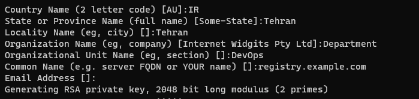
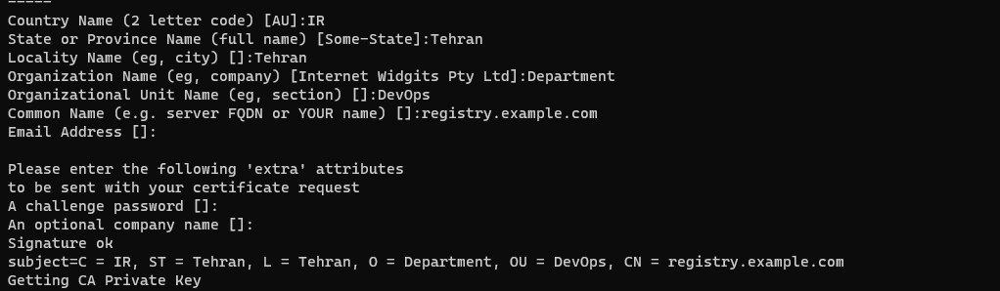
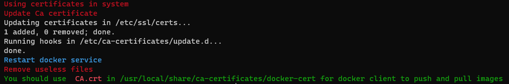

<div align="center">
    <h1 align="center">Docker-Registry v1</h1>
</div>


[](https://github.com/mrunix1998/docker-registry/issues)
[](https://github.com/mrunix1998/docker-registry/stargazers)
[](https://github.com/mrunix1998/docker-registry/network)
[](https://www.gnu.org/software/bash/)


<a href="https://www.linkedin.com/in/mrunix1998/" style="text-align:center">
  
</a>

# Docker-settings
For changing docker to use another path to save config and volumes follow the steps below:

## Stop docker

```bash
systemctl stop docker.service docker.socket
```

## Change settings

First create lib's for docker libraries

```bash
mkdir -p /mnt/docker/lib
```
Then edit docker service 

```bash
vim /lib/systemd/system/docker.service
```

```bash
ExecStart=/usr/bin/dockerd -g /mnt/docker/lib -H fd:// --containerd=/run/containerd/containerd.sock
```

## Restart docker

```bash
systemctl daemon-reload
systemctl start docker
```

## Cloning project

```bash
cd /root
git clone https://github.com/mrunix1998/docker-registry.git
```

## Quick Start

1 - Go to nginx folder :

```bash
cd /root/docker-registry/nginx/
```

- Go to certs file and run bash script to create needed certs for nginx and registry :

```bash
cd certs
bash create_certs.sh
```

**Note** : Write your domain name in both of common name when creating certs.






- Then got to the conf.d file and change registry.conf ==> (line 11, 12, 17)

- Finally, you can start up your nginx container:

```bash
bash setup.sh up
```

2 - Go to registry folder :

```bash
 cd /root/docker-registry/registry/
```

- Run create_reg_user.sh script file to create registry user :

```bash
bash create_reg_user.sh
```

- Finally, run start up script to run registry and registry ui container:

**Note** : Notice that on line 22 change registry admin password.

```bash
 bash setup.sh up
```

**On client** you should set below command in /etc/docker/daemon.json or update certificate to know your registry's CA.crt :

 
```bash
{
  "insecure-registries": [
    "registry.example.com:443"
  ]
}
```

```bash
systemctl daemon-reload
systemctl restart docker
```

or 

- ssh CA.crt from registry vm and then run :

```bash
mkdir /usr/local/share/ca-certificates/docker-cert
cp CA.crt /usr/local/share/ca-certificates/docker-cert
```

```bash
systemctl restart docker
```


### For **login** and **taging** and **push** and **pull** images in registry you should run following commands :


```bash
docker login registry.example.com:443
```


```bash
docker tag <someimage> registry.example.com:443/<someimage>:<tag>
```


```bash
docker push registry.example.com:443/<someimage>:<tag>
```


```bash
docker pull registry.example.com:443/<someimage>:<tag>
```
